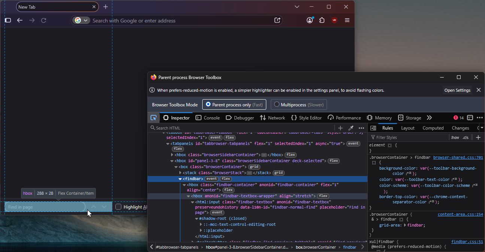

# Contributing

- Required tools: Node 24, [PNPM](https://pnpm.io). Recommended tools:
  [VS Code](https://code.visualstudio.com) ([workspace](./.vscode/) included).

- Run `pnpm run pretty` _in the root of the project_ to reformat the code with
  [Prettier](https://prettier.io). The included VS Code workspace formats files with Prettier when
  they're saved.

- **Do NOT submit AI-authored contributions (commits, PRs, issues, etc.).**

## Style Contributions

The refined findbar `userChrome.css` style is authored as a [Sass](https://sass-lang.com) mixin, at
[`refined-findbar.scss`](./src/refined-findbar.scss).

First, create a temporary Firefox profile to test your changes.

1.  Visit `about:profiles`, press "Create a New Profile" and complete the steps involved.

2.  Open the "Root Directory" of the temporary profile and create an empty `userChrome.css` file in
    its `chrome` directory.

3.  Back in `about:profiles` from step 1, press "Launch profile in new browser"<sub>[B]</sub> to
    open a temporary profile window and complete the onboarding flow, and configure the following
    settings:

    1.  Open `about:preferences`, enable "Open previous windows and tabs"<sup>[A]</sup> in Home and
        startup → Startup.

    2.  Open `about:config`, press "Accept the Risk and Continue". Set the
        `toolkit.legacyUserProfileCustomizations.stylesheets` preference to `true`.

    3.  Open DevTools (<kbd>F12</kbd>), open its settings (<kbd>F1</kbd>), and enable the following
        advanced settings,
        - Enable browser chrome and add-on debugging toolboxes.
        - Enable remote debugging.

    The temporary profile should now be good to go. To inspect the browser UI, open the Browser
    Toolbox (via the menu bar: Tools → Browser Tools → Browser Toolbox; or,
    <kbd>Ctrl</kbd>+<kbd>Shift</kbd>+<kbd>Alt</kbd>+<kbd>I</kbd>) and accept the remote debugging
    connection.

    

Then, configure the `dev` script to build the `userChrome.css` of the temporary profile with the
refined findbar styles.

1. Create a `refined-findbar.dev.scss` file next to `refined-findbar.scss` with the following
   contents.

   ```scss
   @use 'refined-findbar' as rf;

   @include rf.refined-findbar();
   ```

2. The `dev` script in [`package.json`](./package.json) compiles `refined-findbar.dev.scss` to a
   destination CSS file, and is of the format `sass source:destination --options`. Change
   `destination` to point to the `userChrome.css` file of the temporary profile. Escape `\`s in
   Windows paths as `\\`, or replace them with `/`s.

   ```json
   "dev": "sass ./src/refined-findbar.dev.scss:C:/path/to/userChrome.css ...",
   ```

   _This change will be tracked by Git_ so avoid staging it!

3. Run `pnpm run watch`. This will start Sass in watch mode, and recompile `userChrome.css` of the
   temporary profile immediately and whenever any subsequent changes occur.

With the temporary profile and the `dev` script configured, and the `watch` script running, the
development "loop" is,

1. Make your changes to `refined-findbar.scss` and/or `refined-findbar.dev.scss`.

2. Reopen the temporary profile window.

   If you close the temporary profile window with the Browser Toolbox opened, reopening a new window
   of the temporary profile<sup>[B]</sup> will also reopen<sup>[A]</sup> the Browser Toolbox! This
   makes iteration quick, despite having to relaunch Firefox when `userChrome.css` changes.

Once your changes are complete, delete the temporary Firefox profile via `about:profiles`.

## Site Contributions

The site aims to provide,

- A UI to configure options of the refined findbar mixin.
- An approximate preview of the effects of the options.
- An easy way to download the compiled CSS for your configuration.
- Linking to your configuration, which should ease the process of updating the style.
- Details on how to install/update the style in the same place.

Overall, hopefully an improvement over the
[process it replaced](https://github.com/ravindUwU/firefox-refined-findbar/blob/2810a50ec2dc7605a744bb7e4192799ffe8e31be/README.md#usage),
which involved visiting the Sass playground prepopulated with the source of the mixin and an
`@include` rule, hand-editing its arguments, and copying the compiled CSS over.
