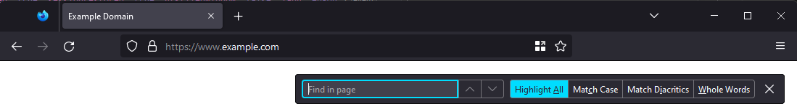
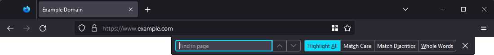
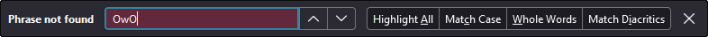

# Refined find bar for Firefox

`userChrome.css`[^userchrome] styles that improve the Firefox find bar by repositioning it,
adjusting spacing and styling its elements.

[^userchrome]:
    Learn more about `userChrome.css` at: https://kb.mozillazine.org/UserChrome.css,
    https://old.reddit.com/r/firefox/wiki/userchrome,
    https://old.reddit.com/r/FirefoxCSS/wiki/index/tutorials

<br>

## Features

<table>
<thead>
<tr>
	<th>Variable</th>
	<th>Description</th>
</tr>
</thead>
<tbody>

<!-- -->
<tr>
<td valign="top"><code>$float</code></td>
<td valign="top">

If `true`, detaches the find bar from the toolbar, and positions it floating above the contents of
web page,



If `false`, positions the find bar towards the top right-hand corner of the browser window, docked
to the toolbar,



</td>
</tr>

<!-- -->
<tr>
<td valign="top"><code>$float-alignment</code></td>
<td valign="top">

Vertically positions the floating find bar. Either `top` or `bottom`.

</td>
</tr>

<!-- -->
<tr>
<td valign="top"><code>$float-distance</code></td>
<td valign="top">

Distance between the floating find bar and the respective window corner.

</td>
</tr>

<!-- -->
<tr>
<td valign="top"><code>$buttons</code></td>
<td valign="top">

If `true`, styles the find bar checkboxes to resemble buttons,


If `false`, leaves them as is,


</td>
</tr>

<!-- -->
<tr>
<td valign="top"><code>$buttons-grouped</code></td>
<td valign="top">

If `true`, groups find bar buttons together,


</td>
</tr>

<!-- -->
<tr>
<td valign="top"><code>$order</code></td>
<td valign="top">

Reorders elements of the find bar.

This is a list that contains all of the following values (listed in the default order), in any
order: `TEXT_BOX`, `CHECKBOX_HIGHLIGHT_ALL`, `CHECKBOX_MATCH_CASE`, `CHECKBOX_MATCH_DIACRITICS`,
`CHECKBOX_WHOLE_WORDS`, `LABELS`, `DESCRIPTION`.

e.g., If the order is specified as `DESCRIPTION`, `LABELS`, `TEXT_BOX`, `CHECKBOX_HIGHLIGHT_ALL`,
`CHECKBOX_MATCH_CASE`, `CHECKBOX_WHOLE_WORDS`, `CHECKBOX_MATCH_DIACRITICS`,



</td>
</tr>

</tbody>
</table>

<br>

## Usage

This style is authored as an [SCSS mixin][sassMixin] and must be transpiled to CSS first.

- **The quickest way to get started** is to,

  1. Visit https://ravindUwU.github.io/firefox-refined-findbar, which will automatically generate a
     link to the [Sass Playground][sassPlay].

  2. Visit the generated link, modify the SCSS as necessary (specifically, the highlighted
     `@include` statement).

  3. Copy the CSS output into your `userChrome.css` file and restart Firefox.

  <details>
  <summary>If that didn't work,</summary>

  1. Open an online transpiler (e.g., [Sass Playground][sassPlay] or
     [SassMeister](https://www.sassmeister.com/)).

  2. Copy the contents of [`refined-findbar.scss`][src] into the SCSS pane.

  3. Add the line `@include refined-findbar()` after the copied contents, and override variables as
     necessary. The default values can be found in the `@mixin refined-findbar` declaration near the
     top of the contents copied in step 2.

     ```scss
     // <contents of refined-findbar.scss>

     // prettier-ignore
     @include refined-findbar(
         $float: true,
         $float-alignment: top,
         // etc..
     );
     ```

  4. Copy the CSS output into your `userChrome.css` file and restart Firefox.

  </details>

- **To transpile locally**, [`@use`][sassUse] the [`refined-findbar.scss`][src] file,
  [`@include`][sassMixin] the mixin changing any variables as necessary, and use [`sass`][npmSass]
  to transpile to CSS.

<br>

[src]: ./src/refined-findbar.scss
[sassUse]: https://sass-lang.com/documentation/at-rules/use/
[sassMixin]: https://sass-lang.com/documentation/at-rules/mixin/
[sassPlay]: https://sass-lang.com/playground/
[npmSass]: https://www.npmjs.com/package/sass
