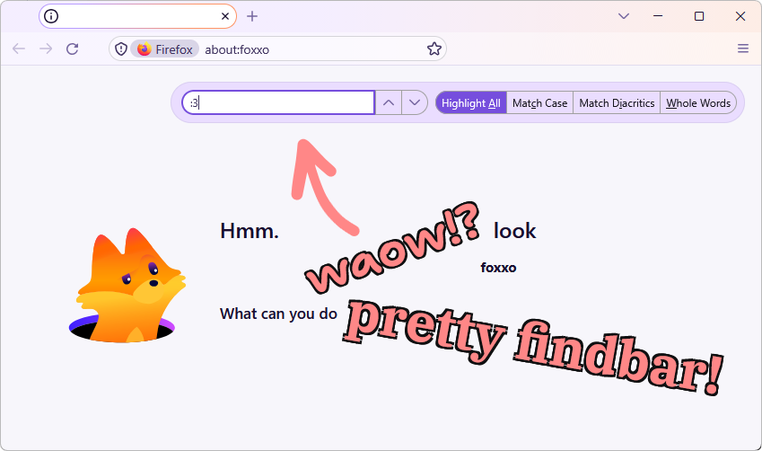

# Refined Findbar

A `userChrome.css` style for a prettier "find in page" (<kbd>Ctrl</kbd>/<kbd>Cmd</kbd>+<kbd>F</kbd>)
experience in Firefox. Visit
[ravinduwu.github.io/firefox-refined-findbar](https://ravinduwu.github.io/firefox-refined-findbar)
to customise &amp; download the style.

<picture>
   <source media="(prefers-color-scheme: dark)" srcset="./img/cover.dark.png">
   
</picture>
